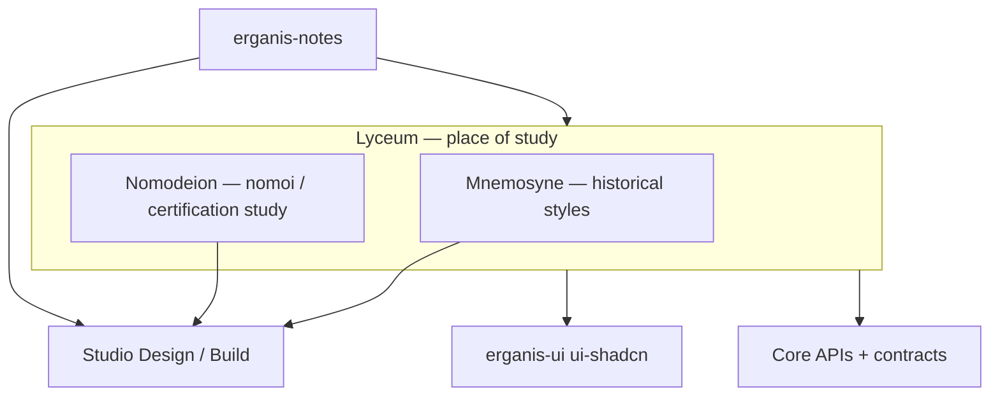

# Lyceum — Implementation Plan

> **Status:** Not started.  
> **Product plan:** [§10 Lyceum](../../../docs/erganis-product-plan.md#10-lyceum) · **UI:** [`UI-ARCHITECTURE.md`](../../ui/docs/UI-ARCHITECTURE.md) · **Index:** [IMPLEMENTATION-PLANS](../../../docs/IMPLEMENTATION-PLANS.md)

**GitHub:** `erganis-lyceum` · **Path:** `lyceum/`

**Lyceum** (*lykeion* — hall of learning) is the **umbrella space** for study and reference products. Consumer-facing brands live inside it:

| Component | Brand | Meaning |
|-----------|-------|---------|
| **Mnemosyne** | Mnemosyne | Memory of design history — historical styles |
| **Nomodeion** | Nomodeion | Place of the *nomoi* (νόμος) — law, custom, professional standards; certification study |

---

## Overview

| Phase | Component | Name | Delivers | Platform deps |
|-------|-----------|------|----------|---------------|
| **L-M0** | Mnemosyne | Content model | Style entry schema, tags, era/region | Core contracts |
| **L-M1** | Mnemosyne | Public web | Browse + search | `erganis-ui` (ui-shadcn) |
| **L-M2** | Mnemosyne | API layer | Dedicated Nest API + DB **or** Core-backed | TBD |
| **L-M3** | Mnemosyne | Enrichment | Core Scraper Services for reference metadata | Core scraper infra |
| **L-M4** | Mnemosyne | Studio links | Embed/link from Design and Presentations | Studio S-Des1 |
| **L-N0** | Nomodeion | Study paths model | Certification tracks, modules, progress schema | Core contracts |
| **L-N1** | Nomodeion | Public web | Study hall UX — paths, practice, progress | `erganis-ui` |
| **L-N2** | Nomodeion | NCIDQ track | IDFX, IDPX, PRAC study content + practice | L-N0 |
| **L-N3** | Nomodeion | Sustainability & wellness | LEED (GA, AP ID+C), **WELL AP** tracks | L-N0 |
| **L-N4** | Nomodeion | Extended tracks | Accessibility certs, Fitwel, EDAC, LC, NKBA (tier 2) | L-N0 |
| **L-N5** | Nomodeion | Studio / Build links | Cross-link to Build Codes/Standards on project apply | Studio S-B2/S-B4 |
| **L-Notes1** | Notes (Lyceum) | Study guides, personal notes via `erganis.notes` | Notes N1+, L-M1 |



**Notes:** Lyceum consumes the shared **`erganis-notes`** module ([`NOTES-ARCHITECTURE.md`](../../notes/docs/NOTES-ARCHITECTURE.md)) for study guides and personal notes — same Core-loaded module as Studio, different Surfaces and context.

---

## Layout

```
lyceum/
├── web/                    # Shared Next.js shell — routes /mnemosyne, /nomodeion
├── apps/
│   ├── mnemosyne/          # Optional split app
│   └── nomodeion/          # Optional split app
├── api/                    # Optional Nest API
└── shared/                 # Lyceum-specific types (align with Core + ui-contracts)
```

**Stack:** Next.js + `@erganis/ui-shadcn` + Tailwind (same pattern as Studio web).

---

## Mnemosyne (L-M0–L-M4)

Lean, designer-focused reference for **historical styles** — curated for practice, not academic completeness.

| Phase | Delivers |
|-------|----------|
| **L-M0** | Curated style entries; tags, era, region, related movements |
| **L-M1** | Public browse/search — actionable era guidance, motifs, palettes, do/don't pairings |
| **L-M2** | Persistence — dedicated Lyceum DB vs Core content store ([§20 open questions](../../../docs/erganis-product-plan.md#20-open-questions)) |
| **L-M3** | Scraper enrichment for external reference metadata (licensing TBD) |
| **L-M4** | Cross-links from Studio Design exploration and Presentations |

**Distinct from:** Studio **Design** (firm project creativity), **Agora** (vendors/products), **Nomodeion** (certification study).

---

## Nomodeion (L-N0–L-N5)

**Nomodeion** (νομός + place suffix) — *place of the nomoi*: the rules, standards, and credentials of design practice. **Study and exam prep**, not live project rule lookup (that is Studio **Build** S-B2/S-B4).

### Study vs project application

| Layer | Owner | Example |
|-------|-------|---------|
| **Nomodeion** | Lyceum | “LEED AP ID+C practice exam”, “WELL AP v2 flashcards” |
| **Build Codes** | Studio module | Live IBC/ADA rule lookup on a project |
| **Build Standards** | Studio module | WELL/LEED criteria checklist on a submittal |

### Certification tracks

**Tier 1 (v1):**

| Track | Credentials |
|-------|-------------|
| **NCIDQ** | IDFX, IDPX, PRAC |
| **LEED** | GA, AP ID+C (interiors), AP BD+C |
| **WELL** | WELL AP |
| **Accessibility** | CASp, CPABE, general ADA study paths |

**Tier 2 (v2):** Fitwel, EDAC, LC (NCQLP), NKBA (CKBD), Living Building Challenge, Passive House.

**Also (later):** CEU tracking (IDCEC, AIA LU), professional practice, business of design.

### Phases

| Phase | Delivers |
|-------|----------|
| **L-N0** | Study path schema — tracks, modules, questions, user progress |
| **L-N1** | Study hall web — path browser, progress dashboard |
| **L-N2** | NCIDQ content + practice flows |
| **L-N3** | LEED + WELL tracks |
| **L-N4** | Tier-2 certification tracks |
| **L-N5** | “Apply on project” links → Studio Build Codes/Standards when S-B2/S-B4 exist |

---

## Brand note

| Name | Role |
|------|------|
| **Lyceum** | Repository folder + umbrella (place of study) |
| **Mnemosyne** | Consumer brand — memory of design history |
| **Nomodeion** | Consumer brand — nomoi / standards / certification study |

---

## Relationship to platform

| Link | Detail |
|------|--------|
| **Core** | Contracts, Scraper Services, optional auth; C13 agent JSON (optional study assistants) |
| **`erganis-ui`** | Shared web design system with Studio |
| **Studio / Design** | Mnemosyne style references in exploration |
| **Studio / Build** | Nomodeion study ↔ Build Codes/Standards on project |
| **Agora** | Separate — vendors/products |
